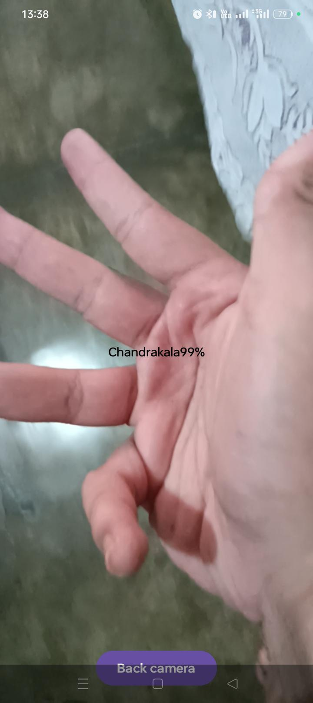

# Edge AI Mudra Recognition (Android)

## Project Overview

- This project is a real-time Android application that recognizes Bharatanatyam mudras using MediaPipe Hand Landmarker and a custom TensorFlow Lite model.

- Instead of classifying raw images, the application first extracts 21 hand landmarks (63 features) and feeds them into a lightweight neural network trained specifically for mudra recognition.

- This approach makes the model lightweight, fast, and suitable for on-device Edge AI inference.

---

## Features

1. Real-time camera preview using CameraX

2. Front and back camera support

3. Real-time hand landmark extraction using MediaPipe

4. Custom TensorFlow Lite mudra classifier

5. On-device inference (No Internet required)

6. Live mudra prediction with confidence score

7. Compose based UI

---

## Tech Stack

Kotlin

Jetpack Compose

CameraX

MediaPipe Tasks Vision

TensorFlow Lite

Android Studio

---

## Model Pipeline

Camera

   ↓
Bitmap

   ↓
MediaPipe Hands

   ↓
21 Hand Landmarks

   ↓
63 Landmark Values

   ↓
Custom TensorFlow Lite Model

   ↓
Predicted Mudra

---

## Project Structure

app/

 ├── ml/
 │      Mudra.tflite
 │
 ├── assets/
 │      labels.txt
 │      hand_landmarker.task
 │
 ├── MainActivity.kt
 │
 ├── HandLandmarkExtractor.kt
 │
 ├── Mudra_classifier.kt
 │
 └── ui/

---

## File Description

### MainActivity.kt

Responsible for:

- Camera Preview

- CameraX lifecycle

- Image Analysis

- Frame skipping

- Calling MediaPipe

- Calling classifier

- Updating Compose UI

- Rendering prediction

---

### HandLandmarkExtractor.kt

Responsible for:

- Loading MediaPipe Hand Landmarker

- Detecting a hand

- Extracting 21 landmarks

- Converting landmarks into 63 float values

- Returning hand bounding rectangle

---

### Mudra_classifier.kt

Responsible for:

Loading custom TensorFlow Lite model

Preparing TensorBuffer

Running inference

Returning prediction confidence

---

### labels.txt

Contains class names corresponding to model outputs.

Example

Pataka
Tripataka
Ardhapataka
...

---

### hand_landmarker.task

MediaPipe model used for extracting 21 hand landmarks.

---

### mudra.tflite

Custom trained TensorFlow Lite classifier.

Input: 63 float values

Output : Probability for each mudra class

---

## Dataset 

- Used : https://www.kaggle.com/datasets/krithi9977/bharatanatyam-mudra-dataset-balanced

Custom dataset generated from Bharatanatyam mudra images.

Training pipeline:

Image
    ↓
MediaPipe Hands
    ↓
21 Landmarks
    ↓
CSV Dataset
    ↓
TensorFlow Model
    ↓
TensorFlow Lite

The classifier is not trained directly on images, but on landmark coordinates extracted from images.

---

## Current Limitations

1. Dataset Dependency

The classifier performs well only for mudras represented in the training dataset.

Unseen mudras or significantly different hand poses may be misclassified.

---

2. Single Hand Detection

Currently supports only one hand at a time.

---

3. Bounding Box Alignment : Not implemented in mudra detector

---

4. Dataset Diversity

Accuracy depends on:

Hand orientations

Different users

Skin tones

Camera distance

Lighting conditions

Increasing dataset diversity will improve robustness.

---

5. Static Mudras

Current implementation recognizes static hand gestures only.

Dynamic mudras involving motion are not supported.

---

## Performance

### Inference runs completely on-device.

Pipeline:

Camera
↓
MediaPipe
↓
TensorFlow Lite
↓
Prediction

No cloud processing is used.

### Screen shot:

---

## Future Improvements

### UI

Accurate bounding box scaling

Draw 21 landmark skeleton

Better prediction card

FPS counter

---

### AI

Expand from current classes to 50+ Bharatanatyam mudras

Confidence thresholding

Temporal smoothing

Gesture tracking

Two-hand mudra recognition

---

### Research Extensions

Bharatanatyam learning assistant

Mudra correctness evaluation

Sequence recognition

Dance step recognition

Complete pose recognition using Pose Landmarker

Educational feedback system

---

## How to Run

1. Clone the repository.

2. Open in Android Studio.

3. Sync Gradle dependencies.

4. Place:

mudra.tflite

hand_landmarker.task

labels.txt in the appropriate folders.

5. Grant camera permission.

6. Run on an Android device.

---

Notes

The TensorFlow Lite model expects 63 normalized landmark values as input.

MediaPipe Hand Landmarker is responsible for generating these landmarks from the live camera feed.

The classifier architecture must match the model used during training.

---

Acknowledgements

Google CameraX

Google MediaPipe

TensorFlow Lite

Jetpack Compose

---

Project Status

Version: v1.0

Status: Functional prototype

Implemented:

✅ Live camera preview

✅ MediaPipe hand landmark extraction

✅ Custom TensorFlow Lite mudra recognition

✅ Real-time prediction

✅ Compose-based Android interface

Planned:

⏳ Improved overlay alignment

⏳ Landmark skeleton visualization

⏳ Expanded mudra vocabulary

⏳ Two-hand gesture support

This version establishes the complete end-to-end Edge AI pipeline for on-device Bharatanatyam mudra recognition and provides a solid foundation for future improvements.